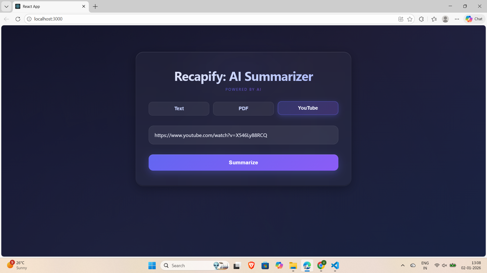

# 🚀 Recapify

Recapify is an AI-powered summarization tool that helps you quickly digest content from text, PDFs, and YouTube videos. Powered by Gemini AI, it delivers concise, high-quality summaries through a React frontend and Flask backend.

---

## ✨ Features

- 📝 **Text Summarization** – Paste text and get instant summaries.  
- 📄 **PDF Summarization** – Upload PDF files for quick content digestion.  
- 🎥 **YouTube Video Summarization** – Summarize video transcripts from any YouTube link.  
- 🤖 **AI-Powered** – Uses Gemini AI for intelligent summarization.  
- 💻 **Responsive Web App** – Modern React frontend + Flask backend.  

---

## 🛠️ Tech Stack

- **Frontend:** React.js  
- **Backend:** Flask (Python)  
- **AI Model:** Gemini AI  
- **Others:** PDF parsing, YouTube transcript extraction  

---

## ⚡ Installation

### 1. Clone the repository
```bash
git clone https://github.com/Vidhi-P05/recapify.git
cd recapify

### 2. Backend Setup
```bash
cd backend
python -m venv venv
source venv/bin/activate   # Windows: venv\Scripts\activate
pip install -r requirements.txt
flask run

### 3. Frontend Setup
```bash
cd ../frontend
npm install
npm start

Open your browser at http://localhost:3000 to access Recapify.

🎯 Usage
1. Open the web app.
2. Select your input type: Text, PDF, or YouTube URL.
3. Click Summarize.
4. Receive an AI-generated concise summary instantly.

📸 Screenshots


🤝 Contributing
We welcome contributions!
1. Fork the repo
2. Create a branch: git checkout -b feature-name
3. Make changes and commit: git commit -m "Add feature"
4. Push: git push origin feature-name
5. Open a Pull Request

